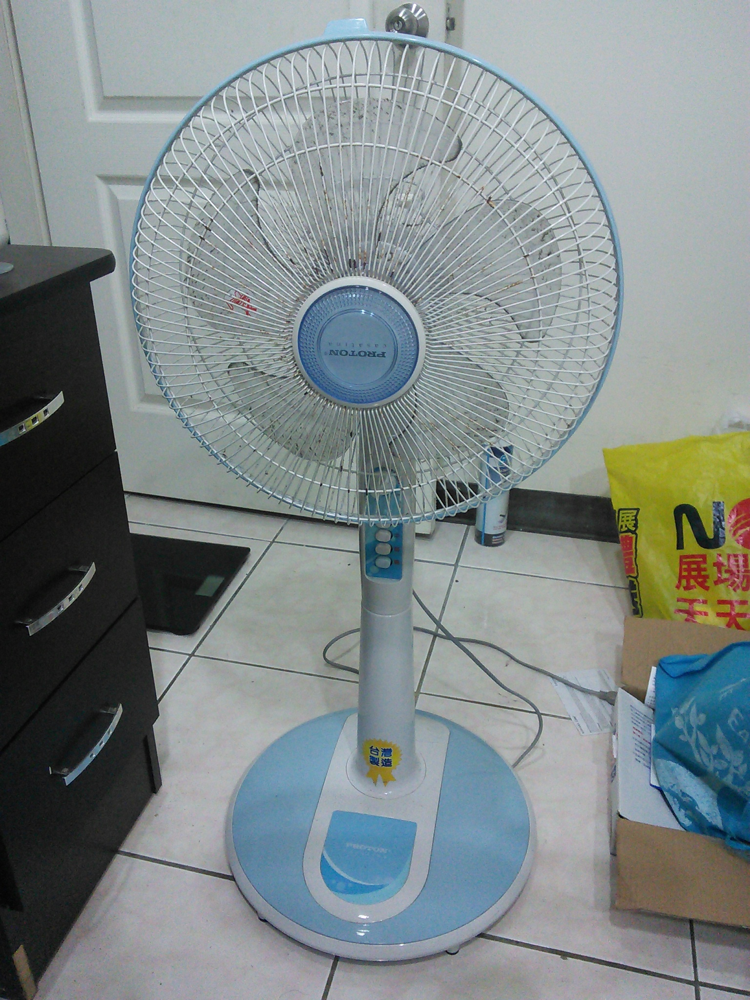

# 如何定期清潔典型的電風扇
#

## 本目錄下的項目說明 Description of the items under this directory
### [圖片/](圖片/)

### [如何定期清潔典型的電風扇　講義.fodt](如何定期清潔典型的電風扇　講義.fodt)

### [.gitignore](.gitignore)
Git 版本控制系統版本追蹤忽略規則

### [說明文件.md README.md](README.md)
本說明文件
